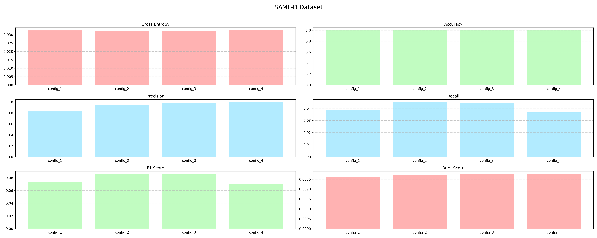
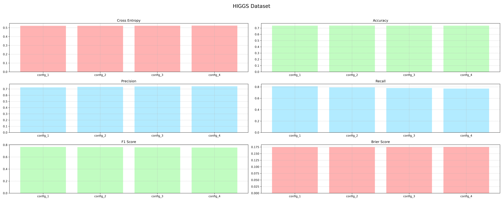
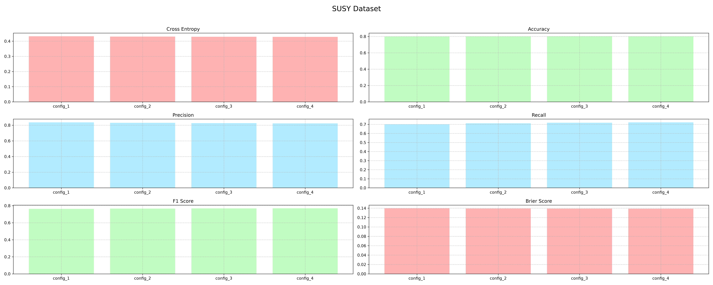

---
# Random Forest Framework

A from-scratch Random Forest framework in NumPy, built around efficient tree construction, scalable training, explicit feature semantics, class-imbalance handling, and custom model persistence.

| **Author**            | Sepanta Metanat (**GitHub:** [github.com/Sepiimt](https://github.com/Sepiimt))                                                 |
| --------------------- | ------------------------------------------------------------------------------------------------------------------------------ |
| **Version**           | 1.3.0                                                                                                                          |
| **License**           | GNU General Public License v3.0 ([LICENSE](https://github.com/Sepiimt/Random-Forest-Framework-From-Scratch/blob/main/LICENSE)) |
| **Core dependencies** | See [requirements.txt](https://github.com/Sepiimt/Random-Forest-Framework-From-Scratch/blob/main/requirements.txt)             |
| **First / last edit** | 2026-02-25 / 2026-08-30                                                                                                        |

---
## Abstract

This repository contains a ground-up implementation of a Random Forest classifier framework for binary classification, built directly on NumPy arrays with no dependence on scikit-learn or any other machine-learning library. The estimator supports both numerical and categorical features under an explicit — never inferred — type declaration; three interchangeable split criteria (`gini`, `class_weighted_gini`, `hellinger`), whose per-node hot paths are compiled ahead of time with `numba`; per-tree bootstrap class balancing for skewed datasets; structural regularization via `min_samples_split`/`min_samples_leaf`; `joblib`-based tree-level parallelism; thread-targeted, cooperative-or-hard-kill system resource limiting (`memory_limit`/`cpu_limit`) wrapped directly around every heavy public method; and a custom `numpy`-native serialization format that flattens each fitted tree into parallel arrays rather than pickling Python objects. `src/` also reserves two sibling namespaces, `ada_boost/` and `gradient_boosting/`, for future ensemble methods — currently empty placeholders with no code of their own. The framework was developed and benchmarked against three binary classification datasets of substantially different character: **SAML-D** (synthetic anti-money-laundering transactions, ~9.5M rows, 962:1 class imbalance), **HIGGS**, and **SUSY** (particle-physics benchmark datasets). Results, memory profiles, and known limitations for all three are reported below.

## Table of Contents

1. [Repository Structure](#1-repository-structure)
2. [Design & Architecture](#2-design--architecture)
3. [Package Reference](#3-package-reference)
4. [Usage](#4-usage)
5. [Empirical Evaluation](#5-empirical-evaluation)
6. [Environment & Requirements](#6-environment--requirements)
7. [Known Constraints & Roadmap](#7-known-constraints--roadmap)
8. [Authorship & License](#8-authorship--license)

---
## 1. Repository Structure

```
.
├── configs/
│   └── rf/                       # TOML configs driving batch train/predict sweeps
│       ├── higgs.toml
│       ├── saml_d.toml
│       └── susy.toml
├── notebooks/
│   ├── 01_data_cleaning_and_examination.ipynb   # Polars streaming ETL for all 3 datasets
│   ├── 02_model_training.ipynb                  # Drives scripts/train.py + predict.py
│   └── 03_model_evaluation.ipynb                # Drives metrics + plotting
├── results/
│   ├── benchmarks/
│   │   └── rf/
│   │       ├── higgs/{model, memory}/            # Per-config metrics.txt + RAM profile
│   │       ├── saml_d/{model, memory}/
│   │       └── susy/{model, memory}/
│   └── figures/
│       └── rf/                                    # Rendered comparison bar charts (.png)
├── scripts/
│   ├── train.py                  # TOML-driven multi-config training loop
│   └── predict.py                # TOML-driven multi-config prediction loop
└── src/
    ├── random_forest/            # The only implemented model — everything below
    │   ├── api/                  # Cross-cutting: types, exceptions, warnings, decorators, meta, resource limits
    │   ├── forest/                # RandomForest estimator + input validation
    │   ├── tree/                  # Node (recursive tree) + numba-jitted split-criteria scoring
    │   ├── metrics/                # Evaluation metrics + report writer
    │   ├── plot/                   # Metric-report → comparison chart
    │   └── utils/                   # Encoder, train/test split, timer, memory tracker
    ├── ada_boost/                 # Reserved namespace — no code yet
    └── gradient_boosting/         # Reserved namespace — no code yet
```

`data/` and `artifacts/` (raw datasets, processed parquet files, trained model weights) are intentionally excluded from version control on account of size; the paths referenced by `configs/rf/*.toml` assume they exist locally in that shape.

`ada_boost/` and `gradient_boosting/` currently ship nothing — not a single file, not even their own `__init__.py`. `configs/`, `results/`, and the artifact directories already nest everything RF-specific one level down under `rf/` in anticipation of those two eventually landing beside it.

---
## 2. Design & Architecture

### 2.1 Feature type is declared, never inferred

`X` is always loaded via `numpy.load(..., mmap_mode='r')`. A memory-mapped array cannot carry mixed `dtypes`, so by the time `X` reaches `RandomForest.fit()` there is no `dtype` signal left from which to infer "this column is categorical." Consequently, categorical columns must be declared explicitly through the `cc_indices` parameter; every unlisted column is treated as numerical. `fit()` turns this into a boolean `is_numerical_mask`, and a parallel `column_position_map` gives each numerical column its position within the reduced, sort-order array used during split search — this indirection is what lets `X_numerical` be sliced out of `X` exactly once per forest rather than re-sliced per node. Both structures are scoped as local variables inside `fit()`, not instance attributes, so a fitted model does not carry them (or the training-time RAM they imply) past the call that built it.

### 2.2 Tree growth

Each `Node` is a plain Python object (`__slots__`-based, no framework overhead) that recursively fits itself: it checks leaf conditions (max depth reached, empty node, below `min_samples_split`, or purity already past `min_leaf_purity` on either side), and if none apply, asks `tree/criteria.py` for the best available split among a random subset of `sqrt(n_features)` columns (the conventional Random Forest feature subsampling heuristic). Rows are routed by `<=` for numerical splits and `==` for categorical ones; sort order for numerical columns is computed once per tree and remapped — not recomputed — for each child, via cumulative-sum-based index bookkeeping in `Node._remap_sort_order`.

### 2.3 Split criteria

All three criteria share the same expensive step — extracting `(left_total, left_true, right_total, right_true)` for every candidate split via a single sorted cumulative-sum scan (numerical) or a crosstab (categorical) — and differ only in the scoring formula applied to those four numbers:

**Gini impurity** (`"gini"`, default) — unweighted, child-size-weighted:

```
p_left, p_right = left_true/left_total, right_true/right_total
score = (left_total/node_total) * 2·p_left·(1-p_left)
      + (right_total/node_total) * 2·p_right·(1-p_right)        # lower is better
```

**Class-weighted Gini** (`"class_weighted_gini"`) — identical formula, but every sample is first weighted by `(weight_for_0, weight_for_1) = n_total / (2 · class_count)`, resolved once from the *original, whole* training `Y` — deliberately not the per-tree bootstrap sample — which is what keeps this criterion meaningful whether or not `bootstrap_balance` is also active. Requires `Y` encoded as 0/1. 
Mirrors scikit learn's `"balanced"` (whole-dataset) heuristic rather than `"balanced_subsample"`.

**Hellinger Distance** (`"hellinger"`) — a divergence rather than an impurity (higher is better), following "Cieslak & Chawla" (2008):

```
TPR = left_true / node_true                      # share of the node's positives sent left
FPR = (left_total - left_true) / node_false       # share of the node's negatives sent left
score = sqrt( (sqrt(TPR) - sqrt(FPR))^2 + (sqrt(1-TPR) - sqrt(1-FPR))^2 )
```

Because Hellinger scores class-conditional rates *within the node*, it is inherently insensitive to class skew without any explicit weighting — this is the criterion used across all three benchmark sweeps below.

### 2.4 Numba-accelerated hot paths

Every per-node numeric routine on the critical path is now `@njit`-compiled: `criteria.py`'s split-count extraction (`_numerical_split_counts`, `_none_numerical_split_counts` + its crosstab helper) and all three scorers (`_score_gini`, `_score_class_weighted_gini`, `_score_hellinger`); `tree.py`'s `_left_child_mask_creator` and `_remap_sort_order`; and `forest.py`'s `_build_column_position_map`.

`_remap_sort_order` in particular is not a straightforward vectorized port: NumPy's stride-based 2-D boolean fancy-indexing (the original implementation) is not something Numba supports for masks above one dimension, and a flatten-then-copy workaround paid for two full `N × n_features` temporaries just to fake it. The current version walks each column with an explicit loop instead — slower-looking on paper, faster in practice, and with no intermediate array at all.

> **Note:** Numba compiles each `@njit` function once per process, the first time it's actually called with a given argument-type signature, and caches the compiled code for every call after that. In a training sweep that runs several configs back-to-back in one process (see §4.2), the *first* config pays that compilation cost on top of its own training time; every config after it does not. This is visible in the SAML-D timings in §5.2, where Config 1 — despite having the shallowest trees in its sweep — is not the fastest.

### 2.5 Structural regularization

Independent of and stackable with the criterion above: `min_samples_split` (default `2`) forbids a node below that many samples from attempting a split at all; `min_samples_leaf` (default `1`) rejects any candidate split that would leave either child under that count, applied vectorized across every candidate before scoring.

### 2.6 Class imbalance handling — `bootstrap_balance`

Orthogonal to the split criterion: this parameter reshapes *what each tree sees*, not how it scores what it sees.

| Value | Behavior |
|---|---|
| `None` (default) | Plain bootstrap — `rng.choice(n_rows, size=n_rows)`, unweighted |
| `float` in `(0, 1)` | Explicit target minority proportion per tree. All minority rows drawn with replacement (full pool); majority rows drawn without replacement where the pool allows it |
| `"auto"` | Ratio resolved from the data as `min(sqrt(minority/(minority+majority)), 0.5)` |

The `"auto"` heuristic deliberately dampens the true imbalance with a square root rather than equalizing fully to 1:1 — on a skew as extreme as SAML-D's (~962:1), full rebalancing would discard nearly all majority-class diversity in every tree. It is a stated heuristic, not a canonical named algorithm; an explicit float is available for cases where it doesn't fit the data.

### 2.7 Parallelism

Trees are trained independently via `joblib.Parallel(backend="loky")`, one process per tree, seeded from a single `np.random.SeedSequence` spawned into per-tree child sequences for reproducibility. `X_numerical` — the numerical-only, float32-cast slice of `X` — is computed once in `fit()` and handed to every worker, rather than recomputed inside each one. Prediction parallelizes the same way across trees, falling back to sequential execution below 1,000 rows or `n_jobs=1` where process spawn overhead would dominate. Numba's role is orthogonal to this: it speeds up the CPU-bound math *inside* a single node's split search, while `joblib` still owns parallelism *across* trees — the two don't overlap in what they're accelerating.

### 2.8 Serialization

Fitted trees are **not** pickled. `save_model()` flattens every `Node` tree into a preorder traversal across shared parallel NumPy arrays (`node_is_leaf`, `node_column`, `node_left`, `node_right`, …), so that `left_child`/`right_child` become integer array indices rather than nested Python object references, and the whole forest — across however many trees — is written in one `np.savez()` call. `load_model()` reverses this by walking the arrays back into `Node` objects. Optional scalar metadata (`bootstrap_balance`, `class_weights`, etc.) is packed through an explicit kind/value/NaN-sentinel encoding, since `np.savez` cannot hold Python `None` directly. 
This replaced an earlier `joblib`-based save/load path, meaningfully reducing both file size and load time by avoiding Python object graph reconstruction entirely.

### 2.9 Resource-limit decorators — `memory_limit` / `cpu_limit`

`RandomForest.fit()`, `.predict()`, `.save_model()`, and `.load_model()` are all wrapped in `@cpu_limit(0.9)` and `@memory_limit(0.9)`; `Encoder`'s `fit_transform`/`encoder`/`decoder`/`save_model`/`load_model` and `utils.train_test_split()` carry `@memory_limit(0.9)` alone. Each decorator starts a lightweight daemon thread that samples SYSTEM-WIDE RAM/CPU usage on a fixed interval (default `0.25s`) and, once the limit is breached for `consecutive_breaches` samples running (default `2`), aborts the specific thread that called the decorated function — cooperatively by default (raises `ResourceLimitExceeded` the next time that thread executes a bytecode instruction, via CPython's `PyThreadState_SetAsyncExc`, so `finally`/context-manager cleanup still runs), or immediately and uncatchably via `os._exit()` if `kill_switch=True`. A `_CallState` lock coordinates the wrapper and its monitor so a breach detected right as the call finishes can't fire an async exception into whatever code runs next on that thread.

Wherever `@requires_fit` is also stacked on the same method, it sits outermost, above the resource-limit decorators — `requires_fit` relies on the descriptor protocol (`__get__`) to bind `self`, and a plain `functools.wraps`-wrapped closure underneath it doesn't implement that protocol, so anywhere else in the stack it would be silently bypassed.

This design supersedes an earlier `memory.py` module that isolated the guarded call in a `spawn`-context subprocess (functions serialized across the process boundary via `cloudpickle`), which could kill a runaway call outright at the OS level — process and all. The current, in-process design is far lower-overhead and needs no cross-process pickling, but the trade-off is real and stated in the module's own docstring: it can only observe and abort a thread *within the calling process*, so it has no way to reach into, monitor, or terminate a separate `joblib`/`loky` tree-training worker process. It also samples usage for the whole machine, not just this process, so on a shared or noisy box it can trip on someone else's memory spike just as easily as its own.

---
## 3. Package Reference

| Module | Contents |
|---|---|
| `forest/forest.py` | `RandomForest` — `.fit()`, `.predict()`, `.save_model()`, `.load_model()`, `.meta`/`.info` |
| `forest/validators.py` | Refit / path / input-shape guards used by `RandomForest` |
| `tree/tree.py` | `Node` — recursive binary tree: growth, leaf logic, prediction (hot paths `numba`-jitted, see §2.4) |
| `tree/criteria.py` | Split-criterion scoring: `gini`, `class_weighted_gini`, `hellinger` (fully `numba`-jitted, see §2.4) |
| `metrics/metrics.py` | `cross_entropy`, `confusion_matrix`, `accuracy`, `precision`, `recall`, `f1_score`, `brier_score` |
| `metrics/evaluator.py` | `model_evaluator()` — computes + prints/saves a full metrics report |
| `plot/plotter.py` | `model_metrics_plotter()` — turns saved `metrics.txt` reports into comparison bar charts |
| `utils/encoder.py` | `Encoder` — ordinal string↔int codec for categorical columns, with `fit_transform`/`encoder`/`decoder`/persistence, now `@memory_limit`/`@requires_fit`-guarded throughout |
| `utils/train_test_split.py` | `train_test_split()` — shuffle, optional subsample, then split |
| `utils/timer.py` | `timer_function` context manager; `time_capture_function` start/end timer |
| `utils/tracker.py` | `MemoryTracker`, `track_memory` — background-thread RSS *and* USS sampling across the process *and* its `joblib` children (renamed from `profiler.py`/`profile_memory`) |
| `api/decorators.py` | `classproperty`; `requires_fit` (guards methods behind `self.is_fitted` — must sit outermost of any resource-limit decorators, see §2.9) |
| `api/exceptions.py` | `RandomForestError` hierarchy (`ModelNotFittedError`, `AlreadyFittedError`, `InvalidDimensionError`, `InvalidPathError`, `BootstrapBalanceError`, `SerializationError`, `MemoryLimitExceededError`) |
| `api/warnings.py` | `RandomForestWarning` hierarchy (`CategoricalInferenceWarning`, `ResourceLimitWarning`, `AutoBalanceWarning`) |
| `api/resource.py` | `memory_limit`, `cpu_limit` decorators; `ResourceLimitExceeded`, `ResourceMonitorWarning` — see §2.9. Note: this exception/warning pair lives outside the two hierarchies above (see §7) |
| `api/typing.py` | Shared type aliases (`Instructions`, `SplitCriterion`, `Iterable`, `CriteriaTuple`, …) |
| `api/meta.py` | `Meta` — frozen dataclass carrying author/version/technical & usage docs, exposed as `RandomForest.meta` |

Every public method carries its own docstring (`help(RandomForest.fit)`, etc.) — this reference is deliberately a map of *where things live*, not a restatement of each signature.

---
## 4. Usage

### 4.1 Programmatic

```python
from random_forest.forest import RandomForest

model = RandomForest()
model.fit(
    "data/x_train.npy", "data/y_train.npy",
    cc_indices=[2, 3, 4, 5, 6],      # categorical column indices into X — declared, not inferred
    n_trees=140,
    trees_max_depth=200,
    min_leaf_purity=0.999,
    bootstrap_balance="auto",        # or a float ratio, or None
    criterion="hellinger",           # or "gini" / "class_weighted_gini"
    min_samples_split=30,
    min_samples_leaf=30,
    n_jobs=8,
)

probabilities = model.predict("data/x_test.npy")
model.save_model("artifacts/forest/my_model/")

reloaded = RandomForest.load_model("artifacts/forest/my_model/")
```

If any feature is a pre-encoded category stored as a string, run it through `utils.Encoder` first — `X` must be numeric before it is saved to `.npy` and memory-mapped. Note that `fit()`, `predict()`, `save_model()`, and `load_model()` all run under a system-wide 90% RAM/CPU guard (§2.9) — a `ResourceLimitExceeded` from `random_forest.api.resource` is a possible, catchable outcome of any of the four on a machine already under memory/CPU pressure.

### 4.2 Config-driven batch sweeps

`scripts/train.py` and `scripts/predict.py` each take a single TOML config path and iterate over a parameter sweep defined under `[iterable_config]` — which now includes `trees_max_depth` alongside `n_trees`, `min_leaf_purity`, `min_samples_split`, and `min_samples_leaf` (previously depth was fixed per dataset) — saving one model / prediction set per configuration:

```bash
python scripts/train.py configs/rf/saml_d.toml
python scripts/predict.py configs/rf/saml_d.toml
```

A memory profile (`MemoryTracker`, sampling the full process tree including `loky` workers) is recorded for the entire sweep and written alongside the per-config metrics.

### 4.3 Notebook pipeline

`notebooks/01_data_cleaning_and_examination.ipynb` performs the ETL for all three datasets via Polars' lazy API — `scan_csv` → lazy transforms/casts → `sink_parquet`/`collect(engine="streaming")` — keeping memory bounded on multi-gigabyte CSVs. `02_model_training.ipynb` and `03_model_evaluation.ipynb` drive the scripts above and the metrics/plotting utilities respectively.

---
## 5. Empirical Evaluation

### 5.1 Datasets

| Dataset | Raw rows | Used | Train / Test | Class balance | Categorical cols |
|---|---:|---:|---:|---|---:|
| **SAML-D** | 9,504,852 | 100% | 7,603,882 / 1,900,970 | **962 : 1** (9,873 positive) | 7 |
| **HIGGS** | 11,000,000 | 15% subsample | 1,320,000 / 330,000 | roughly balanced | 0 |
| **SUSY** | 5,000,000 | 30% subsample | 1,200,000 / 300,000 | roughly balanced | 0 |

SAML-D is a synthetic anti-money-laundering transaction dataset — the binary target is `Is_laundering`, and the derived `Sender_and_Receiver_Mismatch` / `Currency_Mismatch` flags are engineered during cleaning. HIGGS and SUSY are standard particle-physics binary-classification benchmarks, used here primarily to validate the framework against class-balanced, purely numerical, large-scale data. All three runs below used `criterion="hellinger"` and `bootstrap_balance="auto"`.

> **Note:** SAML-D was used at full size (9.5M rows) because its lower dimensionality kept it inside the hardware budget without subsampling. HIGGS's subsample fraction is **15%** in the current sweep (previously 20%); SUSY is unchanged at 30%. Both remain **hardware-budget decisions, not methodological ones** — see §6 for the exact constraint.

### 5.2 Results

`trees_max_depth` is now swept per-config on all three datasets (previously fixed per dataset) — it's included as its own column below rather than pinned in the section header.

##### **SAML-D**

| Config | Trees | Depth | Purity | min_split / min_leaf | Train time (s) | Accuracy | Precision | Recall | F1 | Brier |
|---|---:|---:|---:|---:|---:|---:|---:|---:|---:|---:|
| 1 | 100 | 100 | 0.980 | 10 / 10 | 20.18 | 0.99897 | 0.8298 | 0.0386 | 0.0738 | 0.00262 |
| 2 | 120 | 200 | 0.990 | 20 / 20 | 15.49 | 0.99898 | 0.9479 | 0.0451 | 0.0861 | 0.00274 |
| 3 | 140 | 200 | 0.999 | 30 / 30 | 17.43 | 0.99898 | 0.9890 | 0.0446 | 0.0853 | 0.00277 |
| 4 | 160 | 300 | 0.999 | 40 / 40 | 20.24 | 0.99898 | **1.0000** | 0.0367 | 0.0707 | 0.00276 |


Peak RAM across the sweep: **4.19 GB RSS / 1.40 GB USS** (baseline 79 MB).

##### **HIGGS**

| Config | Trees | Depth | Purity | min_split / min_leaf | Train time (s) | Accuracy | Precision | Recall | F1 | Brier |
|---|---:|---:|---:|---:|---:|---:|---:|---:|---:|---:|
| 1 | 100 | 300 | 0.96 | 10 / 10 | 1013.55 | 0.7381 | 0.7265 | **0.8107** | **0.7663** | 0.1747 |
| 2 | 120 | 400 | 0.97 | 15 / 15 | 1078.80 | 0.7389 | 0.7354 | 0.7923 | 0.7628 | 0.1747 |
| 3 | 140 | 500 | 0.98 | 20 / 20 | 1181.50 | 0.7384 | 0.7401 | 0.7800 | 0.7595 | 0.1749 |
| 4 | 160 | 600 | 0.99 | 25 / 25 | 1279.81 | 0.7379 | 0.7439 | 0.7705 | 0.7569 | 0.1753 |


Peak RAM across the sweep: **9.72 GB RSS / 7.50 GB USS** (baseline 80 MB).

##### **SUSY**

| Config | Trees | Depth | Purity | min_split / min_leaf | Train time (s) | Accuracy | Precision | Recall | F1 | Brier |
|---|---:|---:|---:|---:|---:|---:|---:|---:|---:|---:|
| 1 | 100 | 200 | 0.96 | 10 / 10 | 594.16 | 0.8006 | **0.8363** | 0.7013 | 0.7629 | 0.1396 |
| 2 | 120 | 300 | 0.97 | 15 / 15 | 621.59 | 0.8014 | 0.8297 | 0.7118 | 0.7662 | 0.1392 |
| 3 | 140 | 400 | 0.98 | 20 / 20 | 689.93 | **0.8018** | 0.8264 | 0.7174 | 0.7681 | 0.1389 |
| 4 | 160 | 500 | 0.99 | 25 / 25 | 755.01 | 0.8016 | 0.8226 | 0.7220 | **0.7690** | **0.1389** |


Peak RAM across the sweep: **6.89 GB RSS / 5.49 GB USS** (baseline 79 MB).

Rendered comparison charts for all three (`results/figures/rf/*.png`) are generated by `model_metrics_plotter()`.

> Two corrections against the previous version of this table: SUSY's bolded "best accuracy" and "best F1" cells were on the wrong rows (Config 4 and Config 3 respectively) — the actual maxima are Config 3 (accuracy) and Config 4 (F1), as shown above. The underlying numbers were never wrong, only which cell got bolded.

Accuracy/precision/recall/F1/Brier are numerically identical to the pre-`numba` sweep at matching configs — same algorithm, same `random_state=42`, so that's expected. What changed is training time and peak RAM, both substantially lower despite the depth sweep now going deeper on HIGGS and SUSY than before (up to 600 vs. 400 previously): `n_jobs` dropped from 8 to 6 workers across every config, and `_remap_sort_order`'s `numba` rewrite (§2.4) no longer allocates the 2-D intermediate arrays its old vectorized form needed. HIGGS shows this most clearly — 14.21 GB peak RSS in the previous sweep, 9.72 GB here.

### 5.3 Discussion

HIGGS and SUSY behave as expected of a class-balanced binary problem: accuracy, precision, and recall all sit in a coherent, unremarkable band across the sweep, and additional trees/depth buy only marginal movement — the ceiling here looks like it belongs to the feature set, not the forest. That holds even now that depth is actively swept rather than fixed per dataset.

SAML-D is the more honest result to report plainly. Accuracy above 0.998 is not informative on a 962:1 problem — a model that never predicts the positive class would already clear 0.998 — and the metric that actually matters, recall, stays in the **3–5% range** across every configuration, even with Hellinger distance (chosen specifically for its skew-insensitivity) *and* auto-resolved bootstrap balancing both active simultaneously. Precision does climb to a clean 1.0 at the deepest configuration, meaning the positives this model does flag are essentially always real, but it is catching only a small fraction of the actual laundering cases in the test set. This is reported as a genuine, currently unresolved limitation on this dataset rather than smoothed over: the two imbalance mitigations implemented here measurably help precision, but neither — alone or combined — closes the recall gap at this depth/purity range. Candidate next steps worth trying, in rough order of expected leverage, would be explicit (rather than `"auto"`) float ratios pushed further past what the square-root heuristic resolves to, class-weighted Gini stacked on top of the Hellinger-selected splits, or reconsidering whether a plain bagged forest is the right model family for a problem this skewed at all.

---
## 6. Environment & Requirements

- **Python ≥ 3.11** — the codebase uses `tomllib` (config scripts), `typing.Self`, and PEP 604 (`X | Y`) union syntax throughout.
- `numba` — required, not optional: every per-node hot path in `tree/`, `tree/criteria.py`, and part of `forest/forest.py` is `@njit`-compiled (§2.4). The first call to any of these in a process pays a one-time JIT-compilation cost; see the note in §2.4 for how that shows up in the SAML-D timings.
- `joblib` (parallel backend: `loky`)
- `psutil` — **required**, not merely "profiling only" as it may first appear: `api/resource.py` imports it eagerly at module load and raises `ImportError` immediately if it's missing, and `memory_limit`/`cpu_limit` (§2.9) are wired directly into `RandomForest.fit/predict/save_model/load_model`, `Encoder`'s methods, and `train_test_split()`. `utils/tracker.py`'s `MemoryTracker` is a separate, opt-in consumer of it for benchmarking.
- `typeguard` (the `@typechecked` decorator enforces signatures at runtime)
- `matplotlib` (plotting only)
- `polars` — used by the notebook ETL pipeline only, not a dependency of the core package

> **Note:** `requirements.txt` is currently shipped with the repository — see [requirements.txt](https://github.com/Sepiimt/Random-Forest-Framework-From-Scratch/blob/main/requirements.txt).

**Benchmarking hardware:** all runs in §5 were produced on a machine with **8 logical CPU cores and 16 GB RAM**. The current sweep configs all set `n_jobs=6` (down from 8 previously) rather than saturating every core. Peak RAM across all three sweeps came in lower than the previous sweep despite this (see §5.2's closing note), so the current runs sit further from the 16 GB ceiling than the numbers alone might suggest.
The subsampling and parallelism choices are read as a constraint of the development environment, not a property of the framework itself — on more generous hardware, all three datasets could reasonably be run at full size and higher `n_jobs`, with the same code, unchanged.

---
## 7. Known Constraints & Roadmap

Stated plainly, in the interest of not overselling the current state:

- **No top-level package `__init__`:** `src/random_forest/` has no `__init__.py` of its own — each subpackage (`forest`, `tree`, `metrics`, `plot`, `utils`, `api`) exports cleanly through its own `__init__.py`, but `import random_forest` currently resolves as an implicit namespace package rather than through an explicit, versioned top-level module. The same applies, more starkly, to `src/ada_boost/` and `src/gradient_boosting/`: neither has any files at all yet, so there's nothing to import from either one.
	
- **No packaging metadata:** The project is consumed via `sys.path.insert()` (see the top of `scripts/train.py`, `scripts/predict.py`, and every notebook), not `pip install -e .`.
	
- **Recursion depth tracks `trees_max_depth`, not row count:** Both `Node.fit()` and `Node.predict()` recurse per tree level. The deepest sweep here (HIGGS, depth up to 600 — up from 400 in the previous sweep) sits well inside Python's default recursion ceiling, but the ceiling is a function of that parameter and it has grown once already; worth remembering if it grows further.
	
- **`min_leaf_purity` is symmetric and can bind late on extreme skews** — at 0.999 purity on SAML-D, a node needs to be almost entirely one class before the purity stop condition fires on its own, leaving depth and `min_samples_split`/`min_samples_leaf` to do most of the practical regularization work.
	
- **Fit-time memory headroom:** As already documented in `Meta.technical_doc`, NumPy's advanced indexing (the per-tree bootstrap gather, the sort-order remap) briefly duplicates slices of the training data during `fit()` — budget beyond the on-disk size of `X`/`Y` accordingly; the peak-RAM figures in §5.2 are a reasonable reference point. The `@memory_limit`/`@cpu_limit` guard (§2.9) is a cooperative safety net on top of this, not a substitute for it: it samples system-wide usage every 0.25s by default and needs two consecutive breaches to trip, so it won't catch a spike that comes and goes faster than that, and it can't reach into a `joblib`/`loky` worker process to abort it directly — only the thread that called the decorated function.
	
- **Subprocess-level resource isolation was traded away:** an earlier `memory.py` module ran the guarded call in a `spawn`-context subprocess and could kill it at the OS level outright. The current `resource.py` (§2.9) is thread-targeted and in-process only — lower overhead, no `cloudpickle` serialization needed, but it cannot abort a separate worker process, only the thread that made the call.
	
- **SAML-D recall:** — see §5.3. Currently the framework's clearest open problem, not a solved one.
	
- **`ada_boost/` and `gradient_boosting/` are empty:** reserved namespaces, no implementation, no timeline stated for now.

---
## 8. Authorship & License

Implemented from scratch by **"Sepanta Metanat"** ([github.com/Sepiimt](https://github.com/Sepiimt)).
Distributed under the **GNU General Public License v3.0**. See [LICENSE](https://github.com/Sepiimt/Random-Forest-Framework-From-Scratch/blob/main/LICENSE) for the full text.

```
Random Forest Framework: Custom machine learning algorithm implementations from scratch.
Copyright (C) 2026  Sepanta Metanat

This program is free software: you can redistribute it and/or modify it under the 
terms of the GNU General Public License as published by the Free Software Foundation, 
either version 3 of the License, or any later version.
```

---
